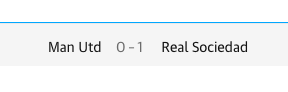

Get the result of football update in recently time.

:::info Source of scrap

https://www.theguardian.com/football/

:::
## `GET` Endpoint

```
/api/football-update/{param}?alias={alias}
```

## How to using

- `param` : club name ex. arsenal
  - replace space with hypen `-`
- `alias` : **optional required** if param is different with club name
  - ex. Manchester United to &rarr; alias=man-utd (tes with source url scrap)  
  
  - just *remove alias* if not needed
---

## Result
```
/api/football-update/arsenal
```
#### <a href='/api/football-update/arsenal' target="_blank">Test </a>🏃🏻‍♂️

```json title="Response Example:"
[
  {
    "home_team": "Zurich",
    "home_score": "1",
    "away_team": "Arsenal",
    "away_score": "2",
    "match_status": "Win",
    "match_url": "https://football.theguardian.com/match-redirect/4343113",
    "match_time": "Thursday 8 September 2022",
    "match_time_short": "Thu 8 September",
    "competition": "Europa League",
    "competition_url": "https://www.theguardian.com/football/champion"
  },
  {
    "home_team": "Man Utd",
    "home_score": "3",
    "away_team": "Arsenal",
    "away_score": "1",
    "match_status": "Lose",
    "match_url": "https://football.theguardian.com/match-redirect/4329863",
    "match_time": "Sunday 4 September 2022",
    "match_time_short": "Sun 4 September",
    "competition": "Premier League",
    "competition_url": "https://www.theguardian.com/football/carabao"
  },
...
]
```